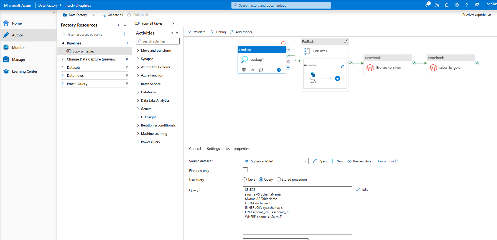
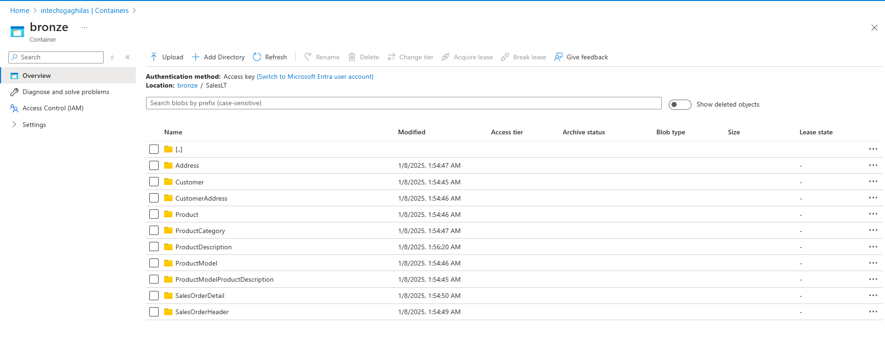

# Table des Matières

1. [Azure End-To-End Data Engineering Project](#azure-end-to-end-data-engineering-project)
2. [Partie 1 : Base de donnée](#partie-1--base-de-donnée)
3. [Partie Création des ressources nécessaires](#partie-création-des-ressources-nécessaires)
4. [Liée Data Factory avec la base de données](#liée-data-factory-avec-la-base-de-données)
5. [Query pour interagir avec la DB](#query-pour-interagir-avec-la-db)
6. [Migration des données](#migration-des-données)
7. [Partie Databricks](#partie-databricks)
   - [Partie connection entre Databricks et Data Lake](#partie-connection-entre-databricks-et-data-lake)
   - [Partie contenaire bronze au contenaire silver](#partie-contenaire-bronze-au-contenaire-silver)
8. [Partie contenaire silver au gold](#partie-contenaire-silver-au-gold)

## Azure End-To-End Data Engineering Project

Ce projet est une solution de pipeline d'ingénierie de données à un problème commercial inventé.

Ce projet répond à un besoin critique de l'entreprise en construisant un pipeline de données complet sur Azure. L'objectif est d'extraire les données relatives aux clients et aux ventes d'une base de données SQL, de les transformer dans et de générer des informations exploitables par un tableau de bord Power BI. Le tableau de bord mettra en évidence les indicateurs clés de performance (KPI) liés à la répartition par sexe et aux ventes par catégorie de produits, permettant aux parties prenantes de filtrer et d'analyser les données par date, par catégorie de produits et par sexe.

## Partie 1 : Base de donnée

Créer un compte Azure : Commencez par créer un compte Azure gratuit sur le site suivant : Azure Portal.

Installer SQL Server Management Studio (SSMS) : Téléchargez et installez SQL Server Management Studio (SSMS) de Microsoft. Une fois l'installation terminée, nous utiliserons une base de données existante pour notre travail.

Télécharger une base de données existante : Vous pouvez télécharger un exemple de base de données, microsoft propose des exemplaires de bases de données , depuis ce lien : https://learn.microsoft.com/en-us/sql/samples/adventureworks-install-configure?view=sql-server-ver16&tabs=ssms

Importer la base de données dans SSMS : Après avoir téléchargé la base de données de votre choix, importez-la dans SSMS pour qu'elle soit visible et exploitable dans le logiciel.

## Partie 2 : Création des ressources necessaires :

- Crée un resource groupe qui va contenaire tous nous ressources pour réaliser ce projet.
- Commencent par le Data factory.
- Ensuit le data lake Gen2.
- Aprés il faut crée une ressource pour databricks.
- Et enfin crée une ressource pour Synapse.
- Et pour finir, telecharger le logiciel Power BI pour la partie visualisation des données dans des rapport.

## Partie 3 : Copée les données depuis SQL server vers le Data Lake Gen 2:
### Creation des secret dans KeyVault :

#### 1. Création des conteneurs dans le Data Lake Gen2
Pour commencer, configurez le service Azure Data Lake Gen2. Dans la section des conteneurs, créez trois conteneurs avec les noms suivants :

bronze : Pour stocker les données brutes.
silver : Pour les données transformées intermédiaires.
gold : Pour les données prêtes à être consommées.
Ces conteneurs serviront à organiser les données en fonction de leur état dans le pipeline d'ingénierie.

#### 2. Configuration des clés et secrets dans Azure Key Vault
Azure Key Vault sera utilisé pour sécuriser les données et gérer les accès aux informations sensibles stockées dans le Data Lake.

##### Étape 2.1 : Création de clés dans Key Vault
Accédez au service Azure Key Vault.
Naviguez vers l'onglet Keys.
Générer une clé d'encryption qui sera utilisée pour sécuriser les données sensibles dans le Data Lake.

##### Étape 2.2 : Création d'un utilisateur pour Key Vault
Naviguez dans l'onglet Access Policies ou Access Control (IAM).
Créez un utilisateur avec les rôles nécessaires pour interagir avec le Key Vault et les autres ressources Azure.
Générer un username et un password pour cet utilisateur.
##### Étape 2.3 : Définition des rôles nécessaires
Avant de créer des secrets, il est essentiel d'ajouter les permissions appropriées à l'utilisateur et aux services qui interagiront avec Key Vault. Voici les rôles à assigner :

Key Vault Administrator : Pour gérer le cycle de vie des clés et secrets.
Storage Blob Data Contributor : Pour accéder et gérer les données dans le Data Lake.

#### 3. Création des secrets dans Key Vault
Dans l'onglet Secrets, créez les secrets nécessaires pour stocker des informations comme :

Les chaînes de connexion pour le Data Lake.
Les mots de passe des services.
Les clés API des autres intégrations (le cas échéant).
Configurez ces secrets pour qu’ils soient accessibles uniquement par les utilisateurs ou services autorisés.

### Pipline dans data factory :
Une fois que la creation du username et password a été fait. il est temps de crée un pipline dans data factory qui va nous permettre de ce connecter a notre sql server.

- Crée une key dans SSMS avec cette commande :
  create login luke with password = '123456789'
  create user luke for login luke
- Ensuite crée un "control access" dans le panelle a droite.
- Une fois crée, maintenant on crée une certificate dans le pannel de key vault.

## Query pour interagire avec la DB:

La requete que on utiliser pour importer les données depuis le serveur SQL de microsoft vers Data factory.

<!-- SELECT 
s.name AS SchemaName, 
t.Name AS TableName
FROM sys.tables t
INNER JOIN sys.schemas s
ON t.schema_id = s.schema_id
WHERE s.name = 'SalesLT' -->

Voila un screen:

## Migration des données.

- Les données sont bien copée de SQL server vers azure data lake notamment le contenaire bronze.
- Voila un screen du contenaire bronze :

- Maintenant la prochaine étape ca sera d'utiliser databricks pour faire des transformation.

## Partie Databricks.

- Utiliser un ETL pour extract, transform et load les données.
- Utilisation de Data Factory pour faire cela.

### Partie connection entre databrics et data lake:

Dans cette partie on va utiliser databricks pour transformé les données de la base de données importé.
- Une chose important a faire est de données accée a databricks pour interagir avec le data factory pour recuperer les données qui sont stocker
dans le contenaire bronze.
- Aprés cette etape on va transformer la data de tables qui sont dans la base de données, Puis en ingecter les nouvelle données dans le contenaire silver.
### Partie contenaire bronze au contenaire silver:

Vous retrouver le code dans un notebook qui explique comment on peut acceder au data factory, faire la tronsformation de la date et enfin stocké les nouvelles 
données dans le contenaire selver.

![Description de l'image][def]

### Partie contenaire silve au gold:
- Dans cette partie on continue le meme processuce de transformation mais cette fois, on va ce concentrer sur transformer les colonnes de tous les tables de 
majuscule vers miniscul.

Une fonction a été implementer pour faire ce travaile de transformation, vous trouver tous le code dans un notebook (silver_to_gold).
une fois la tronsformation est terminer on stock les nouvelle données dans le contenaire gold.
[def]: Images/bronze_to_silver.png